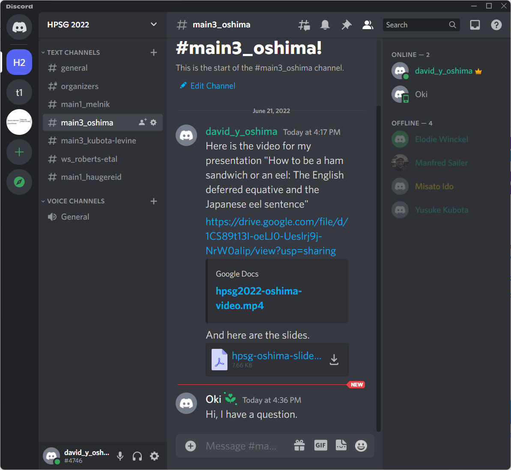

# For participants

## General information

The registered participants will receive a confirmation message containing
information necessary to participate in the Zoom sessions and access the Discord
server. Please refrain from distributing this information to non-registrants.

The **invited talks** will be held live (synchronously) on Zoom.

The **regular presentations** are pre-recorded, but there will be question and
discussion sessions on Zoom.

## How to access videos and other materials

There are separate “channels” for all presentations (main conference and
workshop, regular and invited) on the Discord server.

The presenters will post (links to) their videos and related materials (handout,
slides) on their channel by July 22nd (if not earlier). See the screen shot below
for an example.

## Invited talks and discussion sessions on Zoom

The three invited talks will be held live (synchronously) on Zoom. The invited talks
are 45-minute long, followed by a 15-minute Q&A session.

For regular presentations, only the discussion session (15-minute-long for a long
paper, and 10-minute-long for a short paper) will be held live on Zoom. Discussion
sessions will be moderated by a chair person. The presenters will give a short
summary of their paper (maximum 5 min for a long paper, and 3 min for a short
paper) at the beginning of their session.

When participating in Zoom sessions, please follow the standard courtesy:

1. Your **microphone** should be muted except when you speak.
1. It is encouraged to turn on your **webcam** when you speak.
1. Make **your name on Zoom** transparent, following the format along the lines of:
   - Jane DOE, Nagoya Univ.
   - MORIMOTO Hee-Chul, NINJAL

## Discussion on Discord channels

The presenters’ channels will be used as venues for text-based discussion, too.
Participants may leave their comments and questions, and the presenters will
respond to them when they are available.

## Contact

You can contact the local organizers at the following address:

rirontaisho@gmail.com

or by leaving messages on the #general channel on the Discord server.
